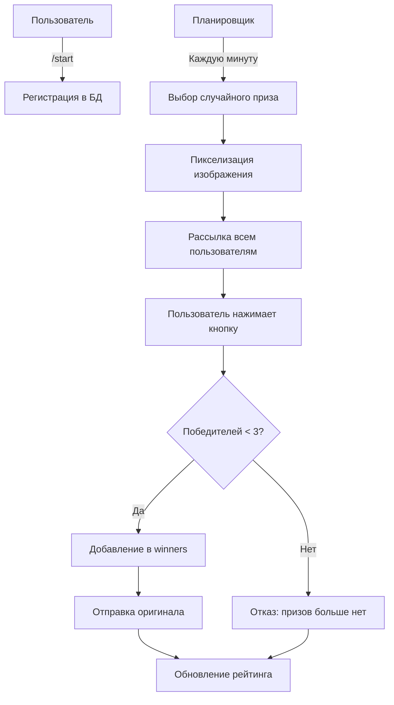

# 🎁 Auction Telegram Bot

```python
# Telegram Bot • PyTelegramBotAPI • SQLite3 • OpenCV • Schedule
# Версия: 1.0.0 | Статус: Активен
```

## 📖 О проекте

Автоматизированный Telegram-бот для проведения розыгрышей изображений. Каждую минуту бот рассылает зарегистрированным пользователям пикселизированные версии изображений, а три самых быстрых участника, нажавших кнопку "Получить!", получают оригиналы. Проект демонстрирует работу с многопоточностью, обработкой изображений и системой розыгрышей в реальном времени.

## ✨ Основные возможности

🎁 **Автоматические розыгрыши** - ежеминутная рассылка скрытых изображений  
🏆 **Система победителей** - первые 3 нажавших получают оригинал  
🖼️ **Обработка изображений** - автоматическая пикселизация через OpenCV  
📊 **Рейтинговая система** - топ пользователей по выигрышам  
⚡ **Многопоточность** - параллельная работа рассылки и обработки запросов  
👥 **Регистрация** - автоматическое добавление пользователей в БД  

## 🏗️ Архитектура проекта

### Структура файлов:
```
├── 📄 bot.py           # Основной файл (обработчики команд, потоки)
├── 📄 logic.py         # Бизнес-логика (работа с БД, обработка изображений)
├── 📄 config.py        # Конфигурация (токен, настройки БД)
├── 📄 README.md        # Документация
│
├── 📁 img/             # Оригинальные изображения для розыгрыша
│   ├── prize1.jpg
│   ├── prize2.png
│   └── ...
│
├── 📁 hidden_img/      # Пикселизированные версии для рассылки
│   ├── prize1.jpg
│   ├── prize2.png
│   └── ...
│
└── 📁 venv/            # Виртуальное окружение
```

### База данных SQLite (data.db):
```sql
┌─────────────────┐     ┌─────────────────┐     ┌─────────────────┐
│     users       │     │     prizes      │     │    winners      │
├─────────────────┤     ├─────────────────┤     ├─────────────────┤
│ user_id (PK)    │     │ prize_id (PK)   │     │ user_id (FK)    │
│ user_name       │     │ image           │     │ prize_id (FK)   │
└─────────────────┘     │ used (0/1)      │     │ win_time        │
                        └─────────────────┘     └─────────────────┘
```

## 🤖 Команды бота

| Команда | Описание | Пример |
|---------|----------|---------|
| `/start` | Регистрация в боте | `/start` |
| `/rating` | Топ-10 пользователей по выигрышам | `/rating` |

## 🎮 Процесс работы



## 🚀 Установка и запуск

### Требования:
- Python 3.8+
- Telegram Bot Token (получить у @BotFather)
- Изображения для розыгрыша

### Шаги установки:

```bash
# 1. Клонирование репозитория
git clone https://github.com/yourusername/auction-bot.git
cd auction-bot

# 2. Создание виртуального окружения
python -m venv venv

# 3. Активация окружения
# Windows:
venv\Scripts\activate
# Linux/Mac:
source venv/bin/activate

# 4. Установка зависимостей
pip install pyTelegramBotAPI opencv-python schedule requests

# 5. Настройка конфигурации
# Создайте/отредактируйте config.py:
API_TOKEN = "ВАШ_ТОКЕН_БОТА"
DATABASE = "data.db"

# 6. Подготовка изображений
# Создайте папку img/ и добавьте изображения
mkdir img hidden_img

# 7. Инициализация базы данных
python logic.py

# 8. Запуск бота
python bot.py
```

## 📦 Зависимости

```python
# requirements.txt
pyTelegramBotAPI==4.14.0  # Работа с Telegram API
opencv-python==4.8.1.78   # Пикселизация изображений
schedule==1.2.0            # Планировщик рассылки
requests==2.31.0           # HTTP-запросы
```

## 🔧 Технические детали

### Многопоточность:
```python
# Два параллельных потока
polling_thread = threading.Thread(target=polling_thread)  # Обработка команд
polling_shedule = threading.Thread(target=shedule_thread) # Планировщик рассылки
```

### Обработка изображений (OpenCV):
```python
def hide_img(img_name):
    # 1. Загрузка изображения
    # 2. Применение Gaussian Blur
    # 3. Пикселизация через resize
    # 4. Сохранение в hidden_img/
```

### Логика определения победителей:
```python
if manager.get_winners_count(prize_id) < 3:
    # Первые три пользователя получают приз
    res = manager.add_winner(user_id, prize_id)
else:
    # Остальным отказ
    bot.send_message(user_id, "К сожалению, ты не успел!")
```

## 🗄️ Ключевые функции logic.py

| Функция | Описание |
|---------|----------|
| `create_tables()` | Создание таблиц в БД |
| `add_user()` | Регистрация нового пользователя |
| `add_prize()` | Добавление призов в БД |
| `add_winner()` | Запись победителя |
| `get_random_prize()` | Выбор случайного неиспользованного приза |
| `get_winners_count()` | Количество победителей для приза |
| `get_rating()` | Топ пользователей по выигрышам |
| `hide_img()` | Пикселизация изображения |

## 🎯 Примеры использования

### Регистрация:
```
👤 Пользователь: /start
🤖 Бот: Привет! Добро пожаловать! 
Тебя успешно зарегистрировали!
Каждый час тебе будут приходить новые картинки...
```

### Розыгрыш:
```
🤖 Бот: *отправляет пикселизированное изображение с кнопкой*
👤 Пользователь: [нажимает "Получить!"]
🤖 Бот: *отправляет оригинальное изображение*
```

### Рейтинг:
```
👤 Пользователь: /rating
🤖 Бот: 
|USER_NAME    |COUNT_PRIZE|
|__________________________|
|@user1       | 5          |
|__________________________|
|@user2       | 3          |
|__________________________|
```

## 🚧 Возможные улучшения

- [ ] **Админ-панель** - команды для управления призами
- [ ] **Категории призов** - разделение изображений по темам
- [ ] **Уведомления** - оповещение о новых розыгрышах
- [ ] **Статистика** - расширенная аналитика для админа
- [ ] **Web-интерфейс** - управление через браузер
- [ ] **Инлайн-режим** - отправка призов в другие чаты
- [ ] **Повторные попытки** - автоматическая отправка при сбоях
- [ ] **Кэширование** - оптимизация отправки изображений

## 🐛 Известные проблемы

### Таймауты при отправке:
```python
# Добавьте в bot.py обработку ошибок
def send_photo_safe(chat_id, photo, caption, retries=3):
    for attempt in range(retries):
        try:
            bot.send_photo(chat_id, photo, caption=caption)
            return
        except Exception as e:
            if attempt == retries - 1:
                bot.send_message(chat_id, "Ошибка отправки. Попробуйте позже.")
            time.sleep(2)
```

## 📄 Конфигурация

```python
# config.py
API_TOKEN = "ваш_токен_здесь"  # Токен от @BotFather
DATABASE = "data.db"            # Имя файла базы данных
```

---

<div align="center">
  <sub>Сделано с ❤️ для любителей розыгрышей в Telegram</sub>
  <br>
  <sub>⭐ Не забудьте поставить звезду, если проект полезен! ⭐</sub>
</div>
```

## 🎨 Дополнительные рекомендации

### Для production-версии:
```python
# Добавьте логирование
import logging
logging.basicConfig(level=logging.INFO, 
                   format='%(asctime)s - %(name)s - %(levelname)s - %(message)s',
                   filename='bot.log')

# Используйте переменные окружения
import os
API_TOKEN = os.getenv('BOT_TOKEN', 'default_token')
```

### Для улучшения производительности:
```python
# Добавьте кэш file_id для быстрой отправки
photo_cache = {}

def get_file_id(img_name):
    if img_name not in photo_cache:
        # Отправляем один раз и сохраняем file_id
        with open(f'img/{img_name}', 'rb') as photo:
            msg = bot.send_photo(ADMIN_ID, photo)
            photo_cache[img_name] = msg.photo[-1].file_id
    return photo_cache[img_name]
```
